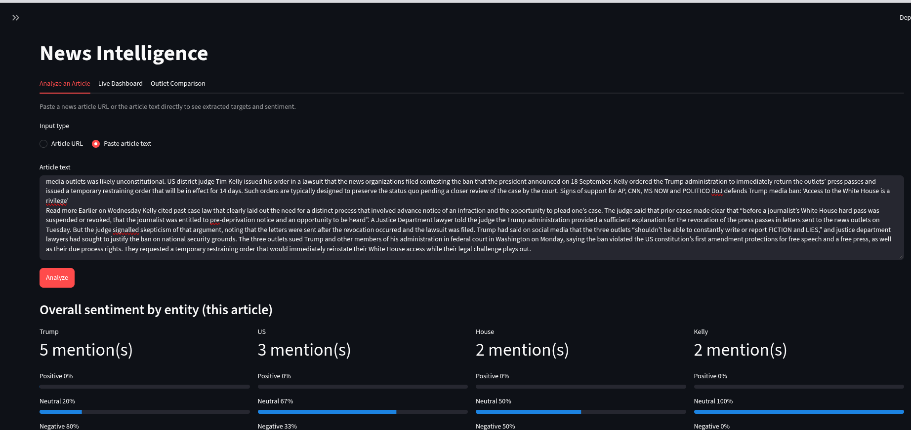
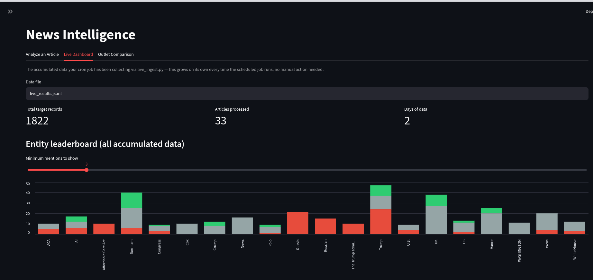
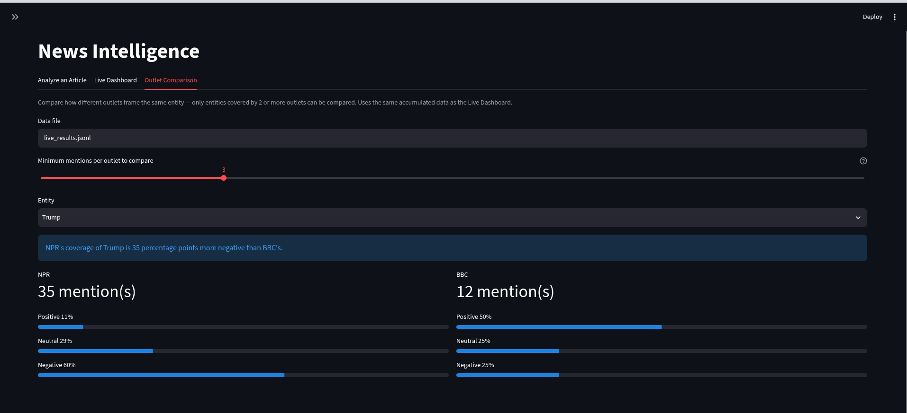

# News Intelligence — Pipeline Overview & How to Run

This is the consolidated reference for the whole target-extraction +
sentiment-prediction pipeline built across this project. If you're
picking this up fresh, start here rather than piecing it together
from scattered files.

## What this project does

Takes a raw news sentence (no annotation needed) and produces:
1. **Target extraction** — who/what is this sentence actually about?
   Can be multiple independent targets per sentence.
2. **Entity resolution** — links pronouns ("it", "his") and generic
   references ("the company") back to the real entity they mean,
   within the same sentence.
3. **Sentiment prediction** — for each target, positive/neutral/
   negative, using a trained DistilBERT classifier.

**Validated performance:**
- Target recall: ~97% against real gold data (`en_core_web_trf`, 1000+ sentences)
- Sentiment agreement with gold labels: ~92% (5,166 comparable records, full corpus)

## Screenshots

An interactive Streamlit app (`src/semantic/app.py`) sits on top of the
pipeline, with three tabs:

**Analyze an Article** — paste any article URL or raw text and get
per-target sentiment, broken down by entity, in seconds.



**Live Dashboard** — a background job (`live_ingest.py`, scheduled via
cron) continuously pulls from multiple RSS feeds, runs them through
the full pipeline, and stores deduplicated results. This tab surfaces
an entity leaderboard and day-over-day sentiment trends from that
accumulated data.



**Outlet Comparison** — compares how different news outlets frame the
same entity, with a minimum-mentions safeguard so a framing-gap claim
is never based on a thin, statistically unreliable sample from one
side.



## Quick start (run locally)

Run everything from the repository root.

```bash
git clone https://github.com/prit-vora93/news-intelligence.git
cd news-intelligence

python3 -m venv venv
source venv/bin/activate            # Windows: venv\Scripts\activate
pip install -r requirements.txt
```

Notes:
- `requirements.txt` pins CUDA/nvidia packages. On a Mac or a machine without an
  NVIDIA GPU, `pip install` may fail on them; remove the `nvidia-*`, `cuda-*`
  and `triton` lines and install again.
- The spaCy models (`en_core_web_sm`, `en_core_web_trf`) are installed from
  the URLs in `requirements.txt`.
- **Model weights are not in the repository.** Copy `model.safetensors` into
  `models/newsmtc_distilbert_final/` (only the config and tokenizer are
  committed). Without it the sentiment model cannot load.

Then:

```bash
# Streamlit app (Analyze an Article / Live Dashboard / Outlet Comparison)
PYTHONPATH=src streamlit run src/semantic/app.py        # http://localhost:8501

# Single-sentence check
PYTHONPATH=src python src/semantic/predict_pipeline.py "Your sentence here."

# REST API
uvicorn src.api:app --reload                            # http://localhost:8000/docs

# Live RSS ingest (feeds the Live Dashboard)
PYTHONPATH=src python src/semantic/live_ingest.py "https://feeds.npr.org/1001/rss.xml" \
    --max-articles 3 --model en_core_web_trf --output live_results.jsonl
```

On Windows PowerShell, set the path first with `$env:PYTHONPATH="src"` instead of
the `PYTHONPATH=src` prefix.

## Repository layout

```
src/                 pipeline code (src/semantic/ = extraction, resolution, live ingest, app)
tests/               integration tests
scripts/             reusable labeling/sampling helpers
scripts/archive/     one-off debug scripts (run from repo root; kept for reference)
data/processed/      train/validation/test CSVs
data/labeling/       sentence lists and labeling trial files
models/              trained model config/tokenizer (weights are gitignored)
outputs/             evaluation results (outputs/archive/ = old ad-hoc run outputs)
docs/                guidelines and screenshots
run_live_ingest.sh   cron wrapper for live ingestion
```

## Pipeline architecture

```
Raw sentence
    v
SemanticExtractor       (semantic_extractor.py)  -- spaCy-based extraction
    v
SemanticGraphBuilder    (semantic_graph.py)       -- organizes entities/events
    v
TargetSelector          (target_selector.py)      -- picks candidate targets
    v
EntityResolver          (entity_resolver.py)      -- resolves pronouns/generics
    v
TransformerPredictor    (transformer_predictor.py) -- your trained sentiment model
    v
(target, sentiment, confidence) per target
```

## File-by-file reference

**Core pipeline** (`src/semantic/`):
- `semantic_extractor.py` — spaCy wrapper; entities, events, relations, subject/object extraction
- `semantic_graph.py` — organizes extractor output into a clean graph
- `target_selector.py` — rule-based target selection (`select_all()` is the main entry point)
- `entity_resolver.py` — pronoun/generic-description resolution (currently your refined V2 version)

**Dataset generation & evaluation:**
- `build_dataset.py` — THE unified tool. Runs the full pipeline over sentences, auto-fills gold labels where trustworthy, optionally runs live sentiment prediction (`--predict`). This is what generates `dataset_final.jsonl`.
- `evaluate_target_selector.py` — measures target-extraction recall against gold CSV data
- `evaluate_sentiment_accuracy.py` — measures sentiment-prediction accuracy against gold labels
- `predict_pipeline.py` — quick single-sentence or small-batch ad-hoc checks (also provides `locate_target_text()`, used by the other scripts)

**Supporting:**
- `transformer_predictor.py` (in `src/`, not `src/semantic/`) — loads and calls your trained model
- `docs/target_annotation_guidelines_v1.md` — target annotation guidelines. (`dataset_schema_v1.md` and `entity_resolver_scope_v1.md`, referenced in earlier notes, are not in this repository.)

## How to run the whole thing

```bash
cd ~/news_intelligence

# Generate the full dataset: extraction + gold-matching + live sentiment prediction
PYTHONPATH=src python src/semantic/build_dataset.py \
    data/labeling/sentences_all.txt dataset_final.jsonl \
    --gold data/processed/train_target.csv \
    --model en_core_web_trf \
    --batch-size 16 \
    --predict
```

Each line of `dataset_final.jsonl` is one target with:
- `target_text`, `role`, `event`, `confidence` — extraction metadata
- `embedded_entities`, `resolved_mentions` — resolution metadata
- `sentiment_label`, `label_source` — gold label, when a trustworthy match exists
- `predicted_sentiment_label`, `predicted_confidence` — live model prediction (always, when `--predict` is used)
- `sentiment_agreement` — `True`/`False`/`None` (`None` = no gold to compare against, not "wrong")

For a single quick check without regenerating the whole corpus:

```bash
PYTHONPATH=src python src/semantic/predict_pipeline.py "Your sentence here."
```

## Known, documented limitations (not bugs — deliberately scoped out)

- **Cross-sentence coreference** — resolver only looks within the current sentence. (The original design note, `entity_resolver_scope_v1.md`, is not in this repo.)
- **Headline/quote-fragment sentences** ("Name: quote", ALL-CAPS headlines) — structurally different from normal clauses, occasionally produce weak targets.
- **Long-clause targets can reduce sentiment accuracy** — confirmed via real disagreement analysis; full-phrase targets are sometimes harder for the model to classify correctly than short entity targets.
- Minor cosmetic inconsistencies (occasional possessive `'s` in `embedded_entities`, rare pronoun-initial phrase leaks like "It all").

## Full history of fixes

The detailed fix history lived in `entity_resolver_scope_v1.md`, which is not in this repository. Use `git log` and `docs/target_annotation_guidelines_v1.md` for the reasoning behind core logic before changing it.

## Possible future direction: expanding beyond political news (not started)

Discussed but deliberately not pursued yet: could the sentiment model
be extended to tech/science/auto news, rather than staying limited to
2016-2017 US politics?

**Recommended approach if this is ever picked up**: expand training
data and retrain the SAME model, rather than building a second
"tech model" and routing/merging between two models. A router needs
its own labeled data too, and real news often straddles domain
boundaries anyway (e.g. "Congress passed a bill regulating AI
companies" is simultaneously political and tech) -- a single model
trained on more diverse data tends to generalize better than two
narrow specialists trained on less data each.

**The real blocker is labeled data, not architecture.**
`transformer_predictor.py` is a plain DistilBERT fine-tune with
`[TARGET]`/`[/TARGET]` markers -- nothing politically-specific in
the architecture itself. Options for sourcing labels, if pursued:
1. Full manual annotation (NewsMTSC-style) -- rigorous but expensive
   at any real scale.
2. Existing ABSA datasets (SemEval Laptop/Restaurant) -- tech-
   adjacent, but a different kind of target (product aspects like
   "battery life", not sentiment toward a company/person in news)
   -- would need task adaptation, not just data merging.
3. LLM-assisted pseudo-labeling -- use the ALREADY-VALIDATED
   extraction pipeline (confirmed working cleanly on tech content,
   e.g. the Paramount/Warner Bros merger sentence) to find candidate
   targets in real tech news, then have an LLM generate draft
   sentiment labels as a starting point -- cheaper than full
   crowdsourcing, but labels would need real spot-checking, not
   blind trust.

If pursued: watch domain balance (too few new examples barely
register; too many risk shifting behavior on the already-validated
political content), and measure accuracy on BOTH a held-out political
test set AND a new tech test set afterward, not just assume nothing
broke. Also note "tech" isn't one domain -- a phone launch, a
clinical trial, and a car recall read very differently, so real
coverage would want genuine diversity within tech/science/auto too.
